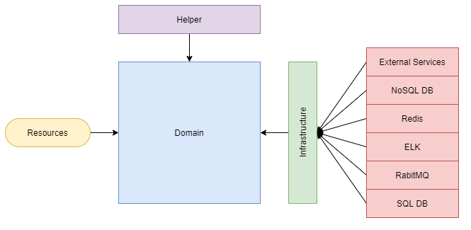

# FastApi Microservices Template

### Resumo

> <p style="text-align: justify"> 
> Este projeto foi construído como resultado de um aprofundamento dos estudos discutidos no blog 
> <a href="https://farlley.com">farlley.com</a> com foco maior na arquitetura <i><b>Domain Driven Design (DDD)</b></i>. 
> Neste trabalho você encontrará um template simples para criação de microsserviços, bem como um caso de uso (que ainda 
> será implementado de acordo com o Roadmap que se encontra neste mesmo documento) aplicando as teorias e estudos apresentados 
> nos livros <i><b>Implementando Domain-Driven Design - Vaughn Vernon</b></i>, <i><b>Domain-Driven Design: Atacando as 
> Complexidades no Coração do Software - Eric Evans</b></i>, e <i><b>Building Microservices: Designing Fine-Grained Systems
>  - Sam Newman</b></i>, a bibliografia consultada será adicionada ao final deste documento em acordo com o roadmap da aplicação. 
> O template foi escrito para a linguagem python em sua versão 3.9.0, utilizando o framework <a href="https://fastapi.tiangolo.com/">
> FastApi</a>. Para a camada de testes utilizamos a biblioteca <a href="https://docs.pytest.org/en/stable/">PyTest</a>. Nossa aplicação faz 
> ainda integração com os seguintes serviços: 
> </p>
>
> <ul>
> <li> Mongo DB </li>
> <li> Elasticsearch </li>
> <li> Rabbit MQ </li>
> <li> Redis </li>
> </ul>
>
> <p style="text-align: justify">
> Ao longo do desenvolvimento do projeto, outras integrações poderão ser adicionadas, desde que, sejam feitas respeitando as diretrizes
> e arquitetura adotadas neste projeto base, com a finalidade de manter sua integridade. Todos os itens pertinentes a arquitetura
> e estrutura do projeto serão extensivamente discutidos nos itens que estão contidos neste mesmo documento. Sinta-se a vontade para
> contribuir com o mesmo.
> </p>

### Roadmap

</br>

> <ol>
> <li> Criação do manual de requisitos para PR. </li>
> <li> Implantação de mais casos de uso. </li>
> </ol>

### Setup

> <p style="text-align: justify">
> Este projeto está estruturado em docker, utilizamos o <i><b>docker-compose</b></i> para montar o processo de startup dos serviços os
> quais a aplicação necessita para rodar. A configuração desses serviços bem como sua estrutura, serão melhor discutidos na seção 
> <a href="#patterns">Estrutura e padrões adotados</a>.
> </p>
>
> <i><b>Para rodar todas as aplicações via docker-compose.</b></i>
>
> <p>
>   <ol>
>    <li> Realize o clone desta aplicação para seu diretório de projetos</li>
>    <li> Dentro deste diretório será possível verificar a criação da pasta: <i><b>ms-fastapi-template</b></i></li>
>    <li> Abra o diretório <i><b>ms-fastapi-template/api/</b></i></li>
>    <li> Neste diretório você encontrará o arquivo <i><b>.env</b></i></li>
>    <li> Para cada serviço contido neste arquivo, altere o host: localhost para o nome do serviço desejado (nome do serviço no arquivo docker-compose).</li>
>   </ol>
>   <p style="text-align: justify">
>   <i><b>Obs</b></i>:
>   <a>
>    Neste arquivo estão as configurações de ambiente do nosso projeto e não, eu optei por não criar um arquivo .ENV por 
>    motivos que discutiremos melhor na seção <a href="#patterns">Estrutura e padrões adotados</a>.
>    </a>
>   </p>
> </p>
>
> <i><b>Trecho Original</b></i>:
>
> ```yaml
> rabbitmq:
>   host: "localhost"
>   port: 5672
>   username: "farlley_ferreira"
>   password: "mstemplate123"
> ```
>
> <i><b>Trecho Ajustado</b></i>:
>
> ```yaml
> rabbitmq:
>   host: "rabbit"
>   port: 5672
>   username: "farlley_ferreira"
>   password: "mstemplate123"
> ```
>
> <p>
>   <ol start="6">
>    <li> Após ajustar o arquivo para todos os serviços desejados, o usuário deverá rodar o comando:</li>
>   </ol>
> </p>
>
> ```bash
> docker-compose up
> ```
>
> <i> &nbsp;&nbsp;&nbsp; Ou em alguns casos </i>
>
> ```bash
> sudo docker-compose up
> ```
>
> <p>
> Se os ajustes tiverem sido feitos de forma adequada a aplicação irá iniciar no endereço <i><b>http://localhost:5000</b></i>:
> e sua documentação via swagger estará ativa via <i><b>http://localhost:5000/docs</b></i>
> </p>
> </br>
>
> <i><b>Para rodar somente o projeto ms-template localmente e o restante via docker-compose.</b></i>
>
> <p>
>   <ol>
>    <li> Realize o clone desta aplicação para seu diretório de projetos</li>
>    <li> Certifique-se de possuir o make instalado em seu OS</li>
>    <li> Crie um ambiente virtual utilizando gerenciador de sua preferência > (pyenv, virtualenv, anaconda...).</li>
>    <li> Dentro deste diretório será possível verificar a criação da pasta: <i><b>ms-fastapi-template</b></i></li>
>    <li> No arquivo docker-compose.yml, dentro deste diretório deverá ser comentado o item referente ao serviço da com tag: <i><b>web</b></i>.</li>
>    <li> Aponte seu terminal para o diretório <b>api</b>, dessa mesma aplicação e execute o comando:</b></i></li>
>   </ol>
> </p>
>
> ```bash
> make install-requeriments
> ```
>
> <i> &nbsp;&nbsp;&nbsp; ou caso não possua o make, poderá rodar o comando:</i>
>
> ```bash
> pip install -r requirements.txt
> ```
>
> <p>
>   <ol start="7">
>    <li> Se todos os pacotes foram instalados corretamente você poderá executar:</li>
>   </ol>
> </p>
>
> ```bash
> docker-compose up
> ```
>
> <i> &nbsp;&nbsp;&nbsp; Ou em alguns casos </i>
>
> ```bash
> sudo docker-compose up
> ```
>
> <p>
>   <ol start="8">
>    <li> Com todos os procedimentos tendo sido executados corretamente você poderá executar:</li>
>   </ol>
> </p>
>
> ```bash
> make run-aplication
> ```
>
> <i> &nbsp;&nbsp;&nbsp; ou caso não possua o make, poderá rodar o comando:</i>
>
> ```bash
> python setup.py
> ```
>
> <p>
> Nossa aplicação estará então disponível para ser utilizada no endereço <i><b>http://localhost:5000</b></i>:
> e sua documentação via swagger estará ativa via <i><b>http://localhost:5000/docs</b></i>
> </p>
>
> <i><b>Para rodar a suíte de testes:</b></i>
>
> <p>
>   <ol start="9">
>    <li> Com todos os procedimentos anteriores tendo sido executados corretamente:</li>
>   </ol>
> </p>
>
> ```bash
> make test-coverage
> ```
>
> <i> &nbsp;&nbsp;&nbsp; ou caso não possua o make, poderá rodar o comando:</i>
>
> ```bash
> pytest --cov-report term-missing --cov=project/
> ```
>
> Ou ainda, de acordo com a preferência do desenvolvedor, os testes poderão ser executados via plugin da sua IDE
> ou editor de códigos preferida, recomendo a [Python Test Explorer for Visual Studio Code](https://marketplace.visualstudio.com/items?itemName=LittleFoxTeam.vscode-python-test-adapter) ou ainda [Test Explorer UI](https://marketplace.visualstudio.com/items?itemName=hbenl.vscode-test-explorer). Já para os testes do tipo BDD que utilizaremos nos casos de uso, recomendo [Pytest BDD](https://marketplace.visualstudio.com/items?itemName=vtenentes.bdd)

### Ops

#### Sonar Qube

> Para garantir a qualidade de código e boas práticas foi adicionado ao projeto uma imagem do SonarQube, a qual pode ser executada através dos seguintes comandos:
>
> ```bash
> cd ops
>
> docker-compose up
> ```
>
> Feito isso, será necessário realizar o download do sonar scanner adequado ao seu sistema operacional, como este projeto foi desenvolvido em um ambiente windows (#mejulgue), você encontrará neste mesmo diretório, a versão para este sistema operacional.
>
> Volte a raiz do projeto, e novamente aponte para o diretório <b>api</b> e execute o comando:
>
> ```bash
> make sonar-scaner
> ```
>
> Este comando executará todas as análises pertinentes e realizará o upload do relatório para o servidor do sonar, que poderá ser acessado em: http://localhost:9000.
> Você poderá observar que dentro do diretório <b>api</b>, será possível encontrar um arquivo denominado <b>sonar-project.properties</b>, que deverá ser alterado de acordo com seu objetivo e a documentação do <a href="https://docs.sonarqube.org/latest/">SonarQube</a>

## <a id="patterns">Estrutura e padrões adotados</a> :european_castle:

> ### Estrutura: :mag:
>
> ```file
>
>   - ms-fastapi-template
>   |   - api
>   |   |   - project
>   |   |   |   - helpers
>   |   |   |   - infrastructure
>   |   |   |   |   - constants
>   |   |   |   |   - drivers
>   |   |   |   |   - monitoring_layer
>   |   |   |   |   - open_api
>   |   |   |   |   - logs
>   |   |   |   - domain
>   |   |   |   - resources
>   |   |   |   - routers
>   |   |   - tests
>   |   |   |   - helpers
>   |   |   |   - infrastructure
>   |   |   |   |   - constants
>   |   |   |   |   - drivers
>   |   |   |   |   - open_api
>   |   |   |   |   - logs
>   |   |   |   - domain
>   |   |   |   - resources
>   |   |   - dockerfile
>   |   |   - makefile
>   |   |   - requirements.txt
>   |   |   - setup
>   |   - ops
>   |   - worker
>   |   - volumes
>   |   - docker-compose.yml
>
> ```
>
> ### Diagrama geral da aplicação: :construction_worker:
>
> 
>
> ### Padrões adotados: :chart_with_upwards_trend:
>
> <p style="text-align: justify">
> O projeto foi concebido de forma a simplificar o de api's, tendo como base o cenário de microsserviços. Neste template, centralizamos em "infrastructure" todos os componentes que possam servir o domínio, seja conexões com bancos de dados, serviços de cache distribuído ou qualquer tipo de integração com serviços externos e suas derivações. Possibilitando maior liberdade para que o desenvolvedor trabalhe no que de fato importa, que é a implementação da camada de negocio.
> </p>
>
> #### Resources.
>
> - <i>Schemas.</i>
>
>   <p style="text-align: justify"> Responsável por modelar os objetos de requisição e respostas expostos pela api. Deverão ser utilizadas de modo a não gerar qualquer tipo de dependência das camadas de modelo de dados, mesmo que em alguns casos possa exibir certo nível de semelhança com os modelos contidos no repositório, em função de isolar sua utilização.
> </p>
>
> - <i>Controllers.</i>
>
>   <p style="text-align: justify"> Responsável por expor os recursos disponíveis ao serviço. Não devem em hipótese alguma possuir qualquer tipo de regra de negócio, sendo responsáveis apenas pelo controle do recurso, no contexto de repassar as requisições ao serviço e, retornar a devida resposta ao item solicitado.
> </p>
>
> #### Domain.
>
> - <i>Business Rules.</i>
>
>   <p style="text-align: justify"> Responsável por processar uma determinada requisição e aplicar as regras de negócio ao dado co0ntexto da requisição, utilizando a ou as, modelos necessárias para executar os processos desejados, com suporte do modulo de validações (caso necessário).
> </p>
>
> - <i>Repository.</i>
>
>   <p style="text-align: justify"> Responsável por conter a representação do domínio na forma de objetos que podem ser do tipo entidade ou objeto de valor. Em contextos específicos, poderão existir particularidades que implementem validações em banco de dados, ou mesmo, validações referentes a tipagem, formatação, entre outros. As validações poderão seguir o padrão do Pydantic, através de Field's, ou ainda métodos customizados assim como você poderá encontrar nos projetos contidos na pasta demo. Os modelos poderão ainda ser construídos utilizando o dataclasses vide documentação (<a href="https://pydantic-docs.helpmanual.io/usage/dataclasses/">dataclass</a>).
> </p>
>
> - <i>Validations.</i>
>
>   <p style="text-align: justify"> Responsável por conter todo e qualquer tipo de regra de validação a ser utilizada por um determinado objeto ou regra de negócio. Escolhemos separar as funcionalidades de validação de forma a tornar o código escrito na camada de regras de negócio mais limpo e desacoplado possivel.
> </p>
>
> #### Infrastructure.
>
> - <i>Constants.</i>
>
>   <p style="text-align: justify"> Responsável por conter todas as variáveis constantes em relação ao projeto, tais como, nomes de recursos de bancos de dados (tabelas, collections, procedures), e outras constantes que poderão ser armazenadas.
> </p>
>
> - <i>Data Layer.</i>
>
>   <p style="text-align: justify"> Responsável por expor na forma de adaptador, as funcionalidades de bancos de dados contidos no projeto, seja via ORM, ou execução direta de comandos. Esta camada não deverá conter qualquer tipo de regra negócio ou similar, servindo única e exclusivamente como uma interface que abstrai a comunicação com o banco de dados.
> </p>
>
> - <i>Drivers.</i>
>
>   <p style="text-align: justify"> Responsável por expor mecanismos de comunicação através de um adaptador com qualquer tipo de serviço externo, via conector, seja a conexão com um banco de dados, api, serviço de mensageria, cache distribuído e etc. As conexões com as dependências externas deverão ser executadas única e exclusivamente através da classe connector do driver em contexto, e expostas através da classe adapter, onde poderão existir métodos de encapsulamento de funções especificas, assim como healthchecks.
> </p>
>
> - <i>dotenv.</i>
>
>   <p style="text-align: justify"> Responsável por conter as variaveis de ambiente do projeto, por padrão, está definida para um arquivo yaml, esta decisão foi tomada com a intenção de facilitar algumas integrações com kubernetes.
> </p>
>
> - <i>Monitoring Layer.</i>
>
>   <p style="text-align: justify"> Responsável por abstrair as funcionalidades de log e monitoramento da aplicação. Caso desejar, poderá realizar a integração com outros serviços, tais como new relic, dynatrace, entre outros.
> </p>
>
> - <i>Open Api.</i>
>
>   <p style="text-align: justify"> Responsável por abstrair e estender as funcionalidades de customização e inicialização do Open Api Specification.
> </p>
>
> #### Helpers.
>
>   <p style="text-align: justify"> Responsável por prover algoritmos de uso geral ao domínio (algoritmos de busca, strategy's, e outras estruturas), devendo ser consumido exclusivamente na camada Domain.
> </p>
>
> ### Observações: :information_source:
>
> <i><b>Pontos importantes:</b></i>
>
> - <p style="text-align: justify"> 
>   Este template foi construído para atender as necessidades de um ambiente de microsserviços, entretanto, poderá perfeitamente ser utilizado em uma arquitetura monolítica, sem alterações do padrão aqui apresentado.
>   </p>
> - <p style="text-align: justify">
>     Toda e qualquer integração com serviços externos deverão ser feitas através da configuração de um driver, que deverá realizar a integração através de um connector e expor as funcionalidades desejadas através de um adapter. Está medida foi tomada de forma a simplificar a disposição destes recursos.
>   </p>
> - <p style="text-align: justify">
>   Não deverão existir quaisquer regras de negócio fora da camada Domain, afinal, ela tem a finalidade de isolar e manter simples a implementação de novas funcionalidades, sem contaminar as camadas mais externas da aplicação.
>   </p>
> - <p style="text-align: justify">
>   Todas as abstrações da camada Data Layer deverão ser implementações utilizando ORM, executores de procedimentos  encapsulados em banco de dados (os quais em teoria não deveriam conter regras de negocio, apenas de armazenamento), ou por fim implementações DSL para acesso a dados.
>   </p>
> - <p style="text-align: justify">
>     Os métodos adicionados em Helpers deverão ser consumidos na camada Domain, não havendo necessidade do seu consumo em outros módulos do sistema, portanto deverá ser mantido o padrão de seu consumo apenas na camada indicada.
>   </p>
>
> ### Bibliografia utilizada: :books:
>
> <p>
>   <ol>
>    <li> COCKBURN, A. Hexagonal architecture. alistair.cockburn.us.</li>
>    <li> EVANS, E. Domain-Driven Design: Tackling Complexity in the Heart of Software. Addison-Wesley.</li>
>    <li> FOWLER, M; et al. Patterns of Enterprise Application Architecture. Addison-Wesley.</li>
>    <li> FOWLER, S. J. Production-Ready Microservices: Building Standardized Systems Across an Engineering Organization. O'REILLY Media Inc.</li>
>    <li> KLEPPMANN, M. Designing Data-Intensive Applications: The Big Ideas Behind Reliable, Scalable, and Maintainable Systems. O'REILLY Media Inc.</li>
>    <li> MARTIN, R. C; HENNEY, K. Clean Architecture: A Craftsman's Guide to Software Structure and Design. Pearson.</li>
>    <li> MARTIN, R. C; WAMPLER, D. Clean Code: A Handbook of Agile Software Craftsmanship. Pearson.</li>
>    <li> NEWMAN, S. Building Microservices, Designing Fine-Grained Systems. O'REILLY Media Inc.</li>
>    <li> VERNON, V. Implementing Domain-Driven Design. Addison-Wesley.</li>
>   </ol>
> </p>
